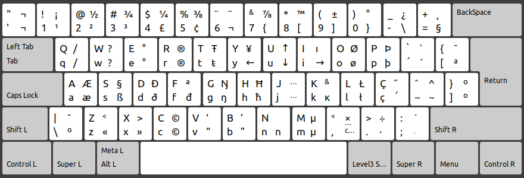
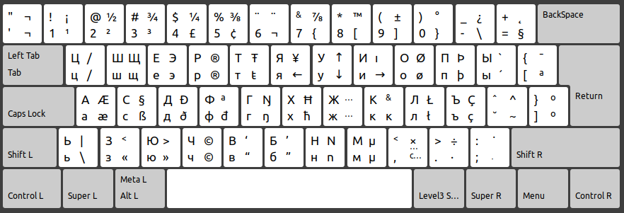

# Layout de teclado com alfabeto russo
Com base no layout de teclado ABNT2 presente no Ubuntu 20, criei um outro layout de teclado com o alfabeto russo (cirílico).
Algumas teclas são definidas de acordo com o som. Por exemplo, 'д' tem som de 'D', por isso ambas estão na mesma posição no teclado.
Pode sofrer alterações.

# Layout padrão


# Layout modificado


# Para instalar:
1. Baixe o arquivo `rubr`
1. Coloque-o na pasta `/usr/share/X11/xkb/symbols/`
1. Edite o arquivo `/usr/share/X11/xkb/rules/evdev.xml`:
    1. Localize a tag `<layoutList>` e cole, na primeira posição, o texto abaixo:
    ```xml
    <layout>
      <configItem>
        <name>rubr</name>
        <shortDescription>RUBR</shortDescription>
        <description>Russian (Qwerty's edit by Igor)</description>
        <languageList>
              <iso639Id>rus</iso639Id>
        </languageList>
      </configItem>
      <variantList/>
    </layout>
    ```
1. Salve o arquivo

**Pronto**. Para mudar para o novo teclado, vá em System Settings > Text Entry > Botão '+' e procure por "Russian (Qwerty's edit by Igor)". Caso queira utilizar o terminal, basta digitar `setxkbmap rubr`.  
Você talvez tenha que reiniciar o computador para funcionar corretamente.
